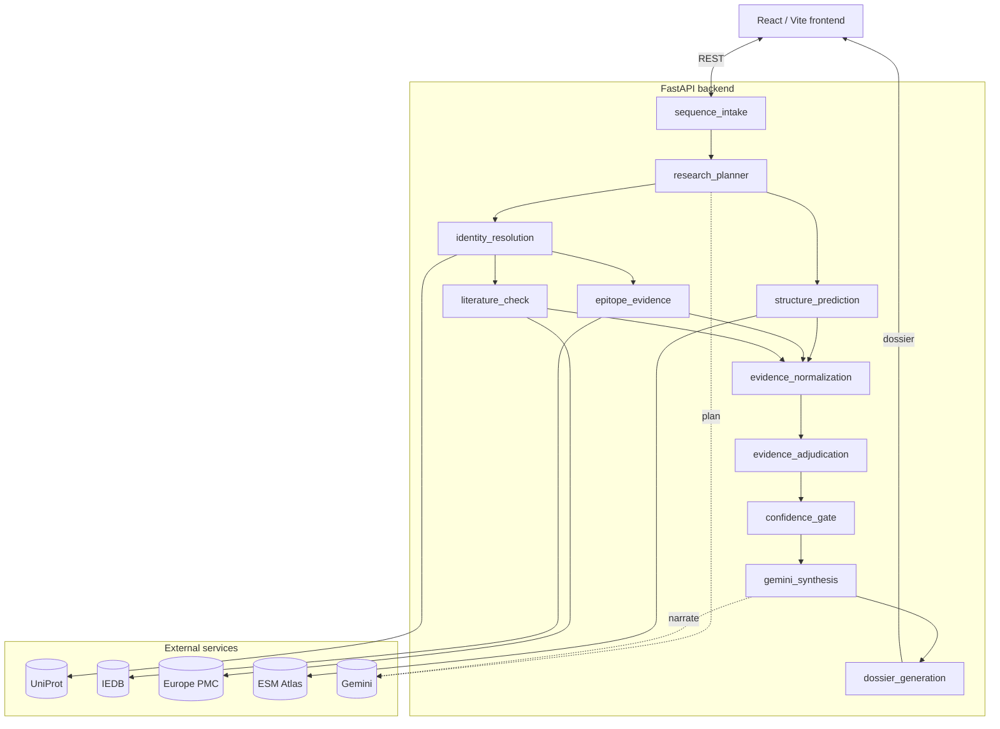

# Curie

Curie is an evidence-aware biological research agent. Give it a protein (or DNA/RNA)
sequence and it investigates it the way a careful researcher would: pull evidence from
several independent scientific sources, check whether that evidence actually agrees,
and only draw a conclusion the evidence supports — abstaining explicitly when it
doesn't.

Research and education software only. Curie makes no clinical claims, no therapeutic
recommendations, and is not wet-lab ready. See [docs/LIMITATIONS.md](docs/LIMITATIONS.md).

## What it does

Given a sequence, Curie runs a [LangGraph](https://github.com/langchain-ai/langgraph)
pipeline that plans an investigation, collects evidence from four real scientific APIs
in parallel where possible, cross-checks that evidence deterministically, and produces
a dossier with a final status, a reproducible evidence score, and a plain-language
summary.

The important design decision is where the LLM sits. Gemini appears in exactly two
places — planning what to investigate, and narrating the result afterward — and in
neither place can it change what's scientifically true. Every deterministic outcome
(evidence score, final status, conflicts, provenance, source identifiers) is computed
by rule-based logic before Gemini ever sees it, and its only output field is a
narration string. If Gemini is unavailable, misconfigured, or returns something
malformed, Curie falls back to its deterministic defaults and still produces a
complete, fully-evidenced dossier.

## Architecture



`structure_prediction` runs alongside `identity_resolution` rather than after it,
since folding only needs the raw residues. `epitope_evidence` and `literature_check`
both depend on identity resolution's output but not on each other, so they run
concurrently one step later. `evidence_normalization` waits for all three collection
branches before adjudication begins. The full reasoning behind this shape is in
[docs/ARCHITECTURE.md](docs/ARCHITECTURE.md).

## The four external integrations

| Service | Used for | Notes |
|---|---|---|
| **UniProt** | Protein identity and annotation | Public REST API, no key required |
| **IEDB** | Curated epitope evidence | Requires a resolved accession |
| **Europe PMC** | Literature grounding | Always treated as indirect evidence, never exact-sequence proof |
| **ESM Atlas (ESMFold)** | Real-time 3D structure prediction | Public API, sequences up to 400 aa |

Every call to every one of these is logged with provider, operation, status, latency,
a request ID, and any error — nothing is asserted without a traceable call behind it.

Gemini sits outside this list on purpose: it's Curie's reasoning layer, not an
evidence source. It never contributes a scientific claim of its own.

## How we know it works

The core claim of this project isn't "the model gave a good answer" — it's that the
*system* behaves correctly: the right tools get called, evidence is honestly labeled,
disagreement gets surfaced instead of averaged away, and the agent abstains when it
should rather than guessing.

Curie's evaluation harness (`curie/evaluation/`) checks that directly, in two parts:

**Scientific benchmark** — six real, well-characterized proteins (SARS-CoV-2 Spike
RBD, ovalbumin, lysozyme, insulin, HIV gp160) run end to end against the live APIs
above. Each run is scored on source retrieval correctness, provenance validity,
evidence grounding, evidence-type honesty, and cross-source agreement.

**Behavioral reliability benchmark** — eight deterministic fault-injection scenarios
run against the real, unmodified graph with only the tool clients patched: an ESM
Atlas timeout, an oversized sequence, an unresolvable accession, conflicting sources,
genuinely insufficient evidence, malformed API responses, homolog-only literature, and
a fully unavailable service. Each one asserts specific, named behavior — no fabricated
result, no silent failure, no confident guess where the evidence doesn't support one.

Latest run (`curie/evaluation/results/latest.json`, regenerated on demand — nothing
below is hand-typed):

| Metric | Result |
|---|---|
| Source retrieval success | 100% |
| Provenance validity | 100% |
| Evidence grounding rate | 100% |
| Evidence-type correctness | 100% |
| Cross-source consistency | 100% |
| Conflict detection | 100% |
| Abstention correctness | 100% |
| Tool recovery success | 100% |
| Unsupported claim rate | 0% |
| End-to-end success | 100% |

Reproduce it yourself:

```bash
python -m curie.evaluation.runner --all
```

This writes a fresh `latest.json` and `latest.md`. The same numbers are also served
from `GET /api/evaluation/latest` and shown live in the frontend's reliability panel.

## Running it locally

**Backend**

```bash
git clone https://github.com/Keerthanareddy17/curie.git
cd curie

python -m venv .venv && source .venv/bin/activate
pip install -r requirements.txt

cp .env.example .env
# optional: add GEMINI_API_KEY to .env for the planning/synthesis steps —
# everything else runs with no keys at all

python -m curie serve   # FastAPI on :8000
```

**Frontend**

```bash
cd frontend/app
npm install
npm run dev              # Vite on :5173
```

Open `http://localhost:5173`, paste a sequence (or use the example target shortcut),
and click Investigate.

**Tests and a manual run**

```bash
pytest                          # full suite, real API calls included
pytest -m "not network"         # offline only

python -m curie report "<sequence>" --accession-hint P0DTC2
```

## Project layout

```
curie/
├── agent/          LangGraph state + pipeline nodes
├── backend/        FastAPI app and routes
├── tools/          UniProt / IEDB / Europe PMC / ESM Atlas / Gemini clients
├── evaluation/      scientific benchmark + fault-injection scenarios + metrics
└── shared/         config, logging, shared models, sequence utilities

frontend/app/       React + Vite UI: sequence input, live agent trace,
                    3D structure viewer, evidence matrix, dossier, reliability panel

tests/              pytest — offline unit tests and live-API integration tests
docs/               architecture, limitations, evaluation methodology, attribution
```

## Deployment

The backend is a standard FastAPI app (`render.yaml` targets Render — binds to
`$PORT`, CORS origins configurable via `CURIE_CORS_ORIGINS`). The frontend is a
static Vite build (deployable to Vercel; point `VITE_API_BASE_URL` at the deployed
backend). Neither platform is required to run Curie locally.


## Demo link : https://drive.google.com/file/d/1iT_zEDrCVO3vL1MHKPigvFWPvgngBAPt/view?usp=sharing
couldn't make it better in the given time frame 🥲

## Limitations

Curie does not perform sequence-homology search — without a supplied accession, it
correctly reports identity as unresolved rather than guessing one. Its evidence score
is a deterministic, reproducible measure of how well-supported a conclusion is, not a
calibrated probability of biological truth. Full detail in
[docs/LIMITATIONS.md](docs/LIMITATIONS.md).

## License

MIT — see [LICENSE](LICENSE).

---

Curie exists to answer a question most agent demos don't: not "did it produce a
plausible answer," but "can we actually verify what it did, and would it tell us if
it couldn't find enough evidence to know?" Every piece of this project — the
deterministic adjudication layer, the fault-injection scenarios, the strict boundary
around what Gemini is allowed to touch — is in service of that question, not the
other way around.
